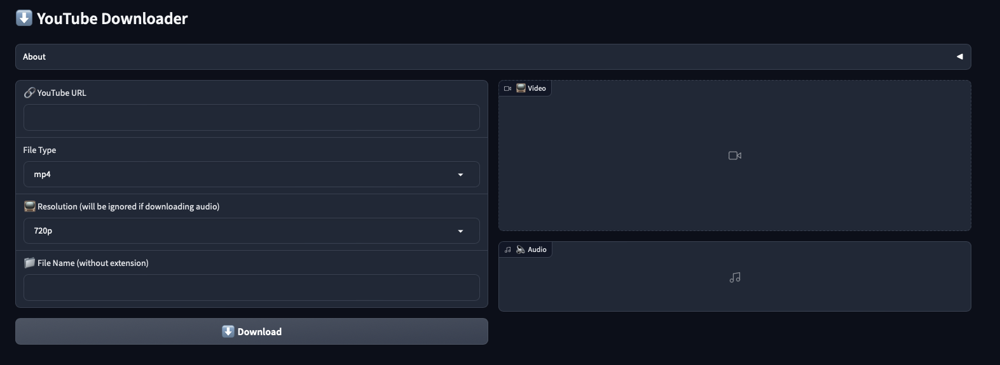

# 🎬 YouTube Downloader

A simple, yet powerful 💪 app to download YouTube videos in various formats.

## 📷 Screenshot

## 🚀 Features
- Download YouTube videos as MP4 🎞️ or MP3 🎵 files.
- Choose the resolution of your download (for video files).
- User-friendly interface for easy downloads.

## 📝 How to Use
1. Copy the URL of the YouTube video you want to download.
2. Open the YouTube Downloader app.
3. Paste the URL into the input field.
4. Choose your desired format (MP4 or MP3).
5. Select the resolution (for MP4 downloads).
6. Click the 'Download' button and wait for your download to complete.
7. Enjoy your downloaded video or audio file!

## 📚 Dependencies
- [pytube](https://github.com/pytube/pytube)

## 📦 Installation
1. Clone this repository.
2. Create a Python 3.10 virtual environment.
3. Move into the cloned repository.
4. Install the package with `pip install -e .`.
5. Run the app with `python -m youtube_downloader`.

## 🙌 Contribution
Contributions, issues, and feature requests are welcome!

## 📃 License
Distributed under the GNU General Public License v3.0. See `LICENSE` for more information.